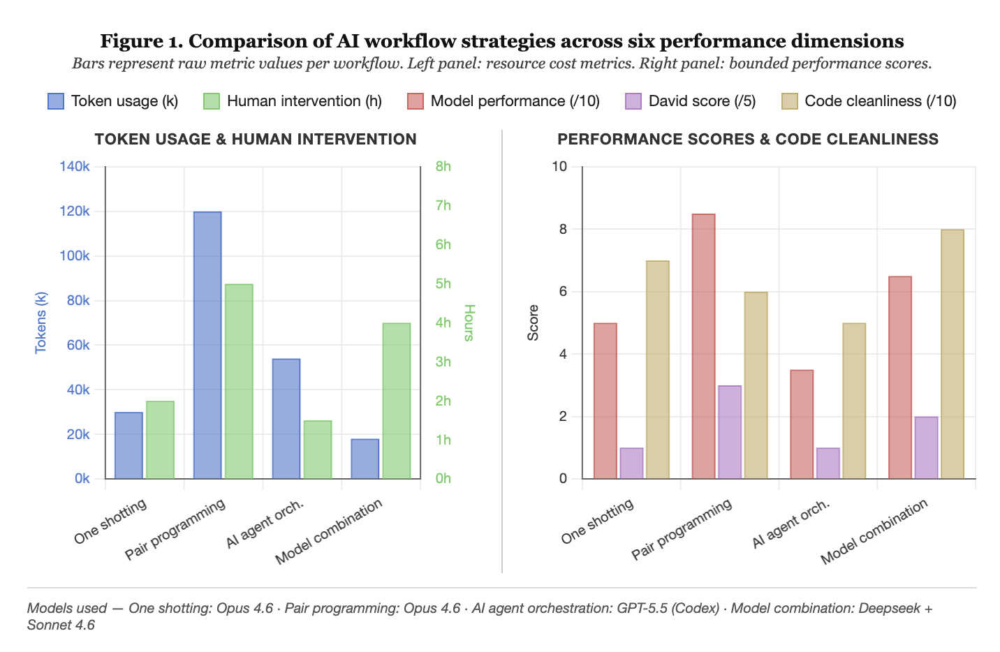

# Novelty Chess Engine



A chess engine that plays surprising, psychologically uncomfortable moves rather than just the objectively best ones. It identifies positions where what looks good on the surface differs from what deep calculation reveals — then plays the move the opponent least expects.

---

## How It Works

The engine has two layers:

### 1. Critical Point Detection (`BasicEngine/critical_point.py`)

Before choosing a move, the engine asks: *is the opponent's intuition about to mislead them?*

It compares two evaluations of the position:
- **Shallow eval** — material + piece-square tables only (what a human sees at a glance)
- **Deep eval** — full negamax search calibrated to the opponent's rating

When `|shallow - deep| > 80cp`, the position is a **critical point** — the surface appearance is deceptive. The deeper the opponent thinks, the worse it gets for them. This is when novelty mode activates.


### 2. KL Divergence Move Selection (`BasicEngine/novelty_engine.py`)

When in novelty mode, the engine selects its move using **KL divergence** between two distributions:

- **Engine distribution** — softmax over minimax scores; what is objectively good
- **Human distribution** — move frequencies from the Lichess Opening Explorer API; what humans actually play

**KL(Engine ∥ Human)** measures how surprised a human player would be by the engine's preferences. High KL means the engine sees something humans routinely miss.

The selected move maximises `engine_prob / human_prob` — the engine likes it, humans don't expect it.

When KL is below threshold (engine and humans broadly agree), the engine falls back to standard best-move play.

---

## Project Structure

```
CubistHackathon/
├── server.py                      # Flask API server
├── index.html                     # Browser chess UI
├── lichess_bot.py                 # Lichess bot client
├── requirements.txt
└── BasicEngine/
    ├── board.py                   # Board representation, move generation
    ├── engine.py                  # Negamax + alpha-beta, piece-square tables
    ├── novelty_engine.py          # KL divergence move selection
    ├── human_model.py             # Lichess API + heuristic fallback
    ├── critical_point.py          # Critical point detector
    ├── uci_bridge.py              # UCI string ↔ Move conversion
    ├── uci.py                     # UCI protocol loop (for chess GUIs)
    ├── test_pipeline.py           # Integration tests
    ├── demo_critical_point.py     # Critical point demo script
    └── unit_tests/                # Unit test suite
```

---

## Quick Start

```bash
git clone https://github.com/NiranjanMedi/CubistHackathon.git
cd CubistHackathon
git checkout niranjan-engine
pip install flask flask-cors requests
python server.py
```

Open **http://localhost:5000** to play in the browser.

---

## API

| Method | Endpoint | Description |
|---|---|---|
| GET | `/api/state` | Current board, turn, legal moves |
| POST | `/api/reset` | Start a new game |
| POST | `/api/move` | Human plays a move, engine replies |
| POST | `/api/engine_move` | Engine plays one move |

Each engine response includes `engine_mode` (`novelty` or `base`), `kl_divergence`, and `engine_reason` so the UI can show why a move was chosen.

**Example:**
```bash
curl -X POST http://localhost:5000/api/move \
  -H "Content-Type: application/json" \
  -d '{"move": "e2e4"}'
```

---

## Lichess Bot

The engine can play on Lichess directly via `lichess_bot.py`. It accepts standard time-control games, handles concurrent games with threading, and uses the KL divergence engine with a negamax fallback.

```bash
export LICHESS_BOT_TOKEN=<your bot OAuth token>
python lichess_bot.py
```

The bot account must be upgraded to a bot account on lichess.org. Generate a token at lichess.org/account/oauth/token with the `bot:play` scope.

---

## Lichess API (optional)

The human distribution defaults to a heuristic model (central pawn preference, development bonuses, capture weight). For real game frequencies, set a Lichess API token:

```bash
export LICHESS_API_TOKEN=<your token>
python server.py
```

---

## Configuration

In `BasicEngine/novelty_engine.py`:

```python
KL_THRESHOLD = 1.0    # Novelty activates above this (higher = less frequent)
TEMPERATURE  = 100.0  # Softmax sharpness (lower = engine more decisive)
EPSILON      = 0.001  # Floor probability for unseen moves
```

In `BasicEngine/critical_point.py`:

```python
DISCOMFORT_THRESHOLD      = 80    # Min shallow-deep gap to trigger novelty (cp)
SIGN_DISAGREEMENT_MULT    = 2.0   # Bonus when evals flip sign (trap condition)
WINNING_THRESHOLD         = 200   # Suppress novelty when already winning by this much
MIN_MOVE_FOR_NOVELTY      = 10    # Don't activate in the opening
```

---

## Testing

```bash
# Integration test of the full pipeline
cd BasicEngine && python test_pipeline.py

# Unit tests
python -m pytest BasicEngine/unit_tests/

# Quick position analysis
python3 -c "
import sys; sys.path.insert(0, 'BasicEngine')
from board import Board
from novelty_engine import analyze_position
a = analyze_position(Board())
print(f'KL: {a[\"kl_divergence\"]:.4f}  novelty={a[\"is_novelty_position\"]}  move={a[\"recommended_move\"]}')
"
```
